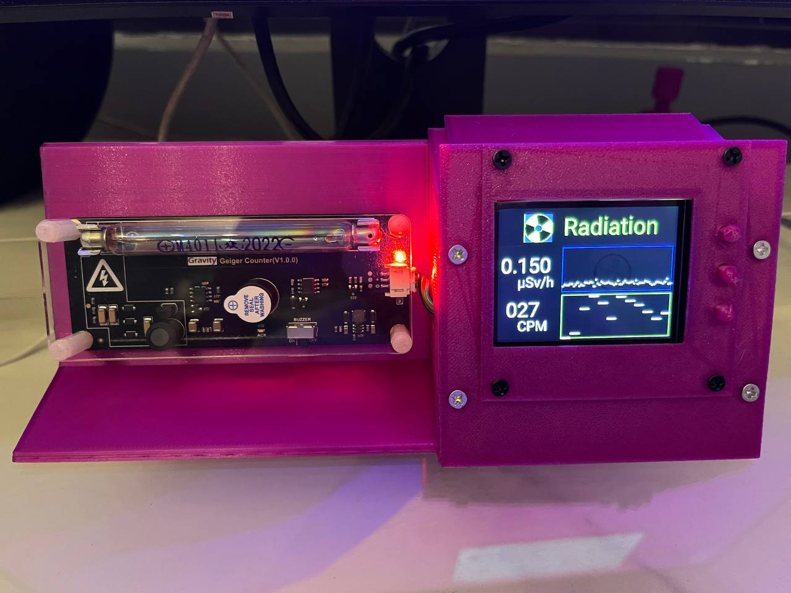
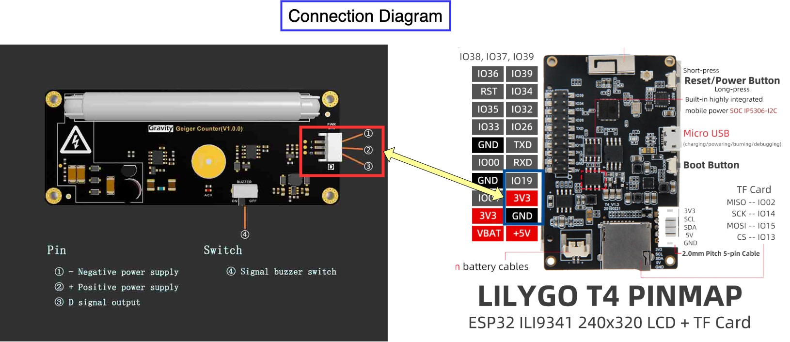

Simple Geiger-Mullercounter based on RadiationD-v1.1 CAJOE board and LILYGO TTGO T4 (ESP32 based).
Displays a sliding average (60s) counts per minute
Displays current counts per second
Displays total counted counts

Switching pages:
The middle button is used to switch pages. Internally this is GPIO 37.

Battery voltage:
Measured using the internal ADC of the ESP32 which is wired to GPIO35 internally. 

Deepsleep:
Implemented deepsleep on GPIO 39 (top button). Wake-up is only possible during 32 seconds after entering deepsleep.  This is limited by the onboard IP5306 which removes power after 32s of low load  (> 45mA) in deepsleep. Consider soldering RST pin to a front pushbutton to restore power. I used GPIO 38. 

Resources:
- GM Tube Info (M4011 - Glass tube)
  https://sites.google.com/site/diygeigercounter/technical/gm-tubes-supported
- Board info / schematics
  https://www.youtube.com/watch?v=K28Az3-gV7E&t=490s

Used parts:
1. DIY assemble geigercounter
https://nl.aliexpress.com/item/1005004100117261.html

2. LILYGO® TTGO 2.4 LCD ESP32 Dev Board
https://www.aliexpress.com/item/32854502767.html

3. Generic 18650 LiPo battery

